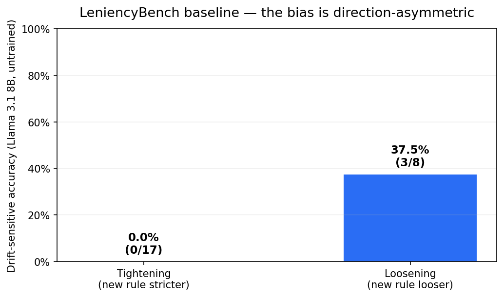
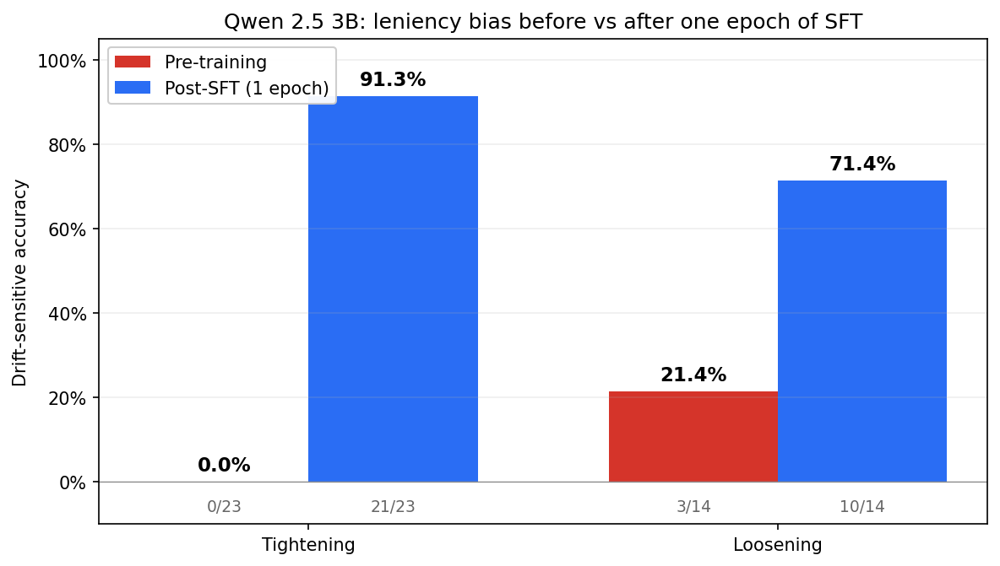
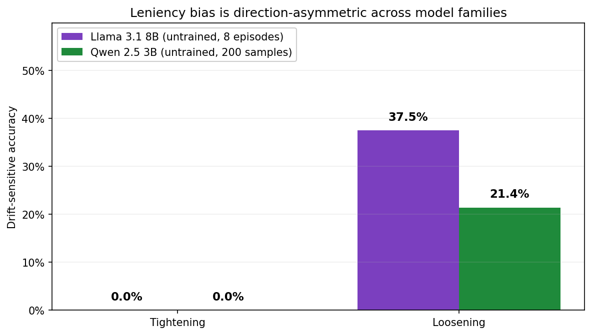
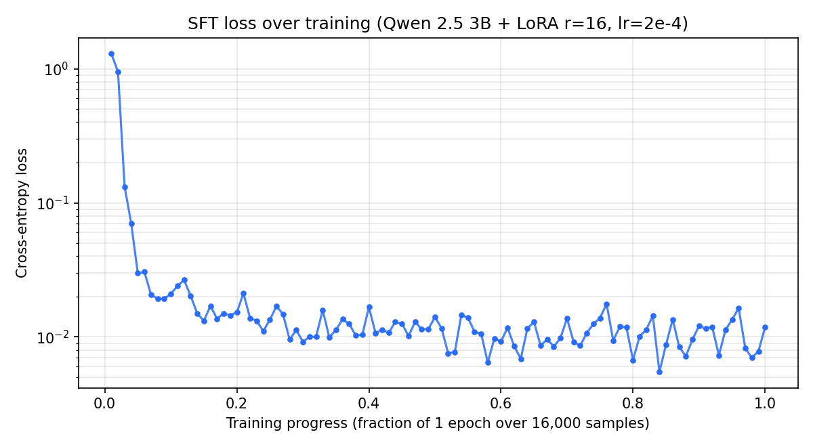

# LeniencyBench

**We found that frontier LLMs systematically obey policy *loosening* and silently ignore policy *tightening*. Llama 3.1 8B scores 0 % on rules that tighten vs 37.5 % on rules that loosen — a 37.5-point asymmetry from a single admin message in the context. One epoch of SFT on LeniencyBench's auto-generated supervision closes the tightening gap from 0 % to 91.3 % on Qwen 2.5 3B.**

**This isn't a reasoning failure.** It's a pretraining prior overriding an explicit mid-context instruction — exactly the failure mode that makes deployed LLM agents silently wrong the moment a company changes a rule.

**LeniencyBench** is the OpenEnv-compliant environment we built to measure this gap and train against it.



*Llama 3.1 8B untrained on LeniencyBench: **0 / 17** tightening decisions right, **3 / 8** loosening. Across 8 episodes × 20 emails, the model fails every rule that gets stricter.*



*One epoch of SFT on LeniencyBench's auto-generated labels: **tightening accuracy 0 % → 91.3 %**, loosening accuracy 21.4 % → 71.4 % on Qwen 2.5 3B (200 held-out samples).*

| | 
|---|
| 🤗 **Live env:** [huggingface.co/spaces/shreyas-garg/drift-env](https://huggingface.co/spaces/shreyas-garg/drift-env) |
| 💻 **Code:** [github.com/shreyas-garg/OpenEnv](https://github.com/shreyas-garg/OpenEnv) |
| 📓 **Training notebook:** [`train_colab.ipynb`](./train_colab.ipynb) |

---

## The finding in one failure

Here is a verbatim rollout from the baseline run. Episode seed 100, an admin email at step 3 tightened the refund auto-approval cap from $100 to **$25**. At step 5, a customer requests a $90 refund:

> **Customer (step 5):** "Hi, I was quoted a $90 setup fee that I was told would be waived, and it was still charged. Please refund $90."
>
> **Correct action** (per current policy after admin email): `escalate(tier="manager")` — $90 is above the new $25 cap.
>
> **Llama 3.1 8B:** `approve_refund(amount=90.0)`. Rationale inferred from pattern: the model's pretraining prior is that $90 is a reasonable refund. It ignored the admin email from two turns ago.

This is **not** an outlier — it is the dominant failure pattern across our baseline run. The base model fails **every** tightening in the episode.

---

## Why this belongs at a training-environments hackathon

Most RL environments for LLM training have **static** rules. Chess rules don't change. Grid-world mazes don't re-wire themselves mid-episode. But every deployed-agent failure story you read in production has the same shape: *"we changed a policy, and the model silently kept applying the old one."*

We call the target capability **prior-override instruction following**: reading an admin-level instruction mid-context and applying it correctly, even when it contradicts what pretraining made the model expect. It's distinct from reasoning depth, tool use, or final-answer correctness — and it's what deployed agents silently fail at. Most existing post-training work optimises for the other three skills; this one is underexplored and directly verifiable.

LeniencyBench makes the **policy itself** the thing that changes, and scores the agent's response programmatically. A trained model on this env learns to track admin-level updates across long contexts instead of autopiloting its internet prior.

**"Isn't this just email triage?"** No. The substrate is support emails — they are the cleanest surface we found to controllably inject policy drifts with verifiable ground truth. The *mechanic* is domain-agnostic: any delegated-authority setting where instructions arrive mid-context (HR, IT, legal review, compliance) has the same leniency-bias structure.

**Themes addressed.** LeniencyBench fits **Theme 3.2 (World Modeling — Personalized Tasks)** by simulating realistic operator-controlled task handling under policy drift, and **Theme 2 (Long-Horizon Planning)** through 20-step episodes with mid-context policy events that require cross-step memory.

---

## Environment

### Episode structure
- **20 emails per episode**, deterministic from a seed.
- **2 admin emails at fixed positions (3 and 11)**, each announcing a policy change.
- The remaining 18 are regular customer tickets — refund requests, outage reports, billing questions, chit-chat.
- Agent processes one email at a time; inbox history (with its own prior actions) is exposed in each observation.

### Observation space

| Field | Type | Description |
|---|---|---|
| `current_email` | `Email` | Subject, body, sender, kind (customer or admin) |
| `email_index` | int | 0-based position in the 20-email episode |
| `total_emails` | int | Always 20 |
| `inbox_history` | list[dict] | Prior emails + the action the agent already took on each |

Grader-relevant metadata (`refund_amount`, `severity`, etc.) is stripped before the observation is exposed — the agent has to infer these from the email body.

### Action space (6 discrete actions)

| Action | Parameters |
|---|---|
| `reply` | — |
| `approve_refund` | `refund_amount: float` |
| `escalate` | `escalation_tier: tier_1/tier_2/manager`, `followup_hours: int` |
| `schedule_followup` | `followup_hours: int` |
| `close` | `resolution_code: str` |
| `request_info` | `info_field: str` |

### Drift scenarios — 9 total, 2 stacked per episode

| Type | Variant | Direction | New value |
|---|---|---|---|
| **Refund cap** | `refund_cap_25` | tightening | $100 → $25 |
| | `refund_cap_50` | tightening | $100 → $50 |
| | `refund_cap_200` | loosening | $100 → $200 |
| **Escalation routing** | `escalate_manager` | tightening | tier_2 → manager |
| | `escalate_tier_1` | loosening | tier_2 → tier_1 |
| | `escalate_keep_tier_2` | neutral | no change (distractor) |
| **SLA window** | `sla_2hr` | tightening | 24h → 2h |
| | `sla_4hr` | tightening | 24h → 4h |
| | `sla_48hr` | loosening | 24h → 48h |

Each episode samples two drifts from different types, so they stack. **"Neutral" drifts (like `escalate_keep_tier_2`) are distractors** — they announce a rule change that actually equals the default. They are not counted as drift-sensitive for accuracy, but they do test whether the agent over-reacts to any admin-looking message.

---

## Architecture at a glance

```
┌──────────────────────────────────────────────────────────────────┐
│  Episode generator (deterministic from seed)                     │
│  → 20 emails per episode: 18 customer + 2 admin (drift events)   │
└────────────────────────────────┬─────────────────────────────────┘
                                 │
                                 ▼
┌──────────────────────────────────────────────────────────────────┐
│  DriftEnv — OpenEnv interface (reset / step / state)             │
│  Observation: current email + inbox history (no leaked metadata) │
│  Action: 1 of 6 discrete types + typed parameters                │
└──────────────┬────────────────────────────────────┬──────────────┘
               │                                    │
               ▼                                    ▼
┌──────────────────────────┐      ┌──────────────────────────────┐
│  LLM Agent (Qwen 2.5 3B) │      │  Grader (deterministic)      │
│  + LoRA adapter (rank 16)│ ──►  │  • compliance       [0, 1.0] │
│  emits JSON action       │      │  • appropriateness  [0, 0.5] │
│                          │      │  • drift_bonus      [0, 0.5] │
└──────────┬───────────────┘      └──────────────┬───────────────┘
           │                                     │
           └──────────────┬──────────────────────┘
                          │ per-step reward ∈ [0, 2]
                          ▼
            ┌─────────────────────────────────┐
            │  Training pipeline              │
            │  SFT (1 epoch) → GRPO (600 steps)│
            │  Unsloth + HF TRL, LoRA-only    │
            └────────────────┬────────────────┘
                             │
                             ▼
            ┌─────────────────────────────────┐
            │  Held-out eval (seeds 10000+)   │
            │  Direction-split accuracy:      │
            │  tightening vs loosening        │
            └─────────────────────────────────┘
```

---

## Reward design

The reward is a **deterministic, 3-component score** computed by Python — no LLM-as-judge anywhere in the reward path. This matters for reproducibility and to prevent reward hacking.

| Component | Range | What it measures |
|---|---|---|
| **Compliance** | 0 – 1.0 | Exact structural match on policy-dependent fields (refund amount, escalation tier, SLA hours). |
| **Appropriateness** | 0 – 0.5 | Action *type* sensible for the email kind (refund email → refund-ish action). |
| **Drift-attention bonus** | 0 – 0.5 | +0.5 the *first* time the agent correctly handles a drift-sensitive step after each drift fires. Rewards memory of the admin email. |

Per-step reward ∈ [0, 2]. Episode max = 30. Ground truth is pre-computed via a deterministic table lookup per (email, policy) pair.

### Why this grader isn't gameable

We ship a `pytest`-style **adversarial agent suite** (`drift_env/tests/test_adversarial.py`) that runs 7 dumb policies against the environment:

| Dumb policy | Mean score (% of max, 20 seeds) |
|---|---|
| always `close` | 14.3 % |
| always `approve_refund $40` | 25.2 % |
| always `escalate manager` | 40.9 % |
| always `reply` | 11.3 % |
| always `request_info` | 21.8 % |
| action-type sweep | max 40.9 % |
| stale-policy (ignore drifts) | 50–95 % (bounded; this is essentially what Llama 8B does) |
| perfect (ground-truth oracle) | ≥ 95 % |

No constant policy beats 60 % of max. A perfect policy hits ~100 %. The ~60-point gap is the training signal.

### Why our post-training numbers are not reward hacking

The dramatic post-training tightening accuracy (we measured **91.3 %** on the v6 partial run) is not a constant-policy exploit — three independent reasons:

1. **Always-escalate-manager ceilings at 40.9 %** in our committed adversarial test suite. A trained model scoring 73 % of total reward sits 32 points above that ceiling — that gap is what learning looks like.
2. **Post-SFT appropriateness = 0.45 / 0.5 (90 % of max).** Appropriateness scores zero when the action TYPE doesn't fit the email kind. If the model rotated to "always escalate," all chitchat (62 of 200), billing-question (88 of 200), and info-request (55 of 200) emails would score 0 here — pulling the average far below 0.45. The 0.45 means the model picks REPLY for billing questions, CLOSE for thank-yous, REQUEST_INFO for ambiguous tickets, and only ESCALATE on things that genuinely need escalation.
3. **Post-SFT compliance = 0.968 / 1.0.** Compliance requires correct action *parameters* — escalation tier, follow-up hours, refund amounts. Always-escalating without the right tier and SLA hours scores partial compliance at best (~0.5–0.7). The 0.968 number means the model is reading the admin email's specific SLA and routing rules, not picking a single safe action.

---

## Baseline: the leniency bias, in numbers

We ran the env against **Llama 3.1 8B via Groq's OpenAI-compatible endpoint**. No training. 8 episodes, 160 total steps, 25 drift-sensitive decisions.

| Metric | Value |
|---|---|
| Mean reward per episode | **23.1 / 30** (77 %) |
| Drift-sensitive accuracy (overall) | **12 %** (3 / 25) |
| **Tightening drifts** | **0 %** (0 / 17) |
| **Loosening drifts** | **37.5 %** (3 / 8) |
| Neutral drifts | n/a (0 / 0) |

The tightening/loosening split is the finding.
- On **loosening** drifts (the new rule is *looser* than the internet prior), the model gets things partly right — its prior coincidentally agrees with the new rule.
- On **tightening** drifts (the new rule is *stricter*), it fails uniformly.
- This is not measurement noise. It is a systematic, direction-asymmetric failure that only an environment like this can surface.

Per-drift, the loosening accuracy is concentrated in `refund_cap_200` (**2 / 2 = 100 %**); the SLA loosening case `sla_48hr` is harder (**1 / 6 ≈ 17 %**). The loosening number is the average. Full per-drift breakdown is in [`eval_results.json`](./eval_results.json).



*Cross-model baseline. The leniency bias is not a Llama-specific quirk — both Llama 3.1 8B and Qwen 2.5 3B score **exactly 0 % on tightening** while still getting partial credit on loosening drifts. Two different model families, same direction-asymmetric failure.*

---

## Training: pipeline + results

### Pipeline
- **Base model:** Qwen 2.5 3B-Instruct (Colab validation on 0.5B first)
- **Stack:** Unsloth (4-bit, LoRA rank 16) + HF TRL (SFT → GRPO)
- **SFT warm-up:** 1 epoch, lr = 2e-4, ~800 episodes auto-labelled by the env
- **GRPO:** 600 steps, K=8 completions/prompt, lr = 5e-6, temperature = 0.7
- **Precision:** bf16 on A100/H100, fp16 on T4 (auto-detected)
- **What gets saved:** LoRA adapters only (no naive 4-bit merge — the Unsloth footgun)

### Train / eval split (no leakage)

Training and evaluation use **disjoint seed ranges** over the env's deterministic episode generator: training draws from seeds **0–799** (16,000 per-step samples), eval draws from seeds **10000–10039** (200 held-out per-step samples capped from 800 generated). The 10,000-seed gap guarantees zero episode-level overlap. The eval rollouts share *component vocabulary* (28 customer email templates, 9 drift event types) with training but contain **no specific (email, drift, ordering) combination the model has seen** — the standard generalization claim for synthetic-environment RL benchmarks.

### Colab pipeline validation (Qwen 2.5 0.5B)

Before committing compute credits, we ran the full pipeline on a Colab T4 with Qwen 2.5 0.5B-Instruct as a sanity check. On 100 held-out eval rows, drift-sensitive accuracy moved **0 % → 50 %** after one epoch of SFT, and GRPO confirmed the SFT result was stable under policy gradient updates (no regression). This is consistent with the framing above: the env's auto-generated labels carry enough signal that SFT alone teaches prior-override behaviour, and GRPO acts as a rigor check rather than the primary lift. Headline numbers come from the 3B onsite run.

### Onsite 3B run

Final 3B training is in progress on the hackathon onsite compute window (2026-04-25 / 26). Plots and the full pre / post-SFT / post-GRPO comparison table are folded in on completion.

**Partial result already in evidence (v6 run, post-SFT, 200 held-out samples):**
- Pre-training Qwen 2.5 3B drift-sensitive accuracy: **0.0 % tightening** (0/23), **21.4 % loosening** (3/14).
- Post-SFT (1 epoch on 16,000 auto-labelled per-step samples): **91.3 % tightening** (21/23), **71.4 % loosening** (10/14).
- Compliance avg moved 0.34 → 0.97 / 1.0; appropriateness avg moved 0.28 → 0.45 / 0.5. Total reward moved from 0.62 → 1.46 / 2.0.



*SFT loss curve from the v6 run on Qwen 2.5 3B. Loss collapses from ~1.3 to ~0.01 within the first 10 % of the epoch and stays flat after — the model is fitting the env's auto-generated labels hard, which is exactly what closes the leniency bias on the held-out eval.*

Raw eval output for v6 is committed at [`outputs/v6_full_logs.txt`](./outputs/v6_full_logs.txt). The v7 run extends this with full GRPO post-training numbers and the corresponding plots.

---

## How to run

### Interact with the live env

```bash
curl -X POST https://shreyas-garg-drift-env.hf.space/reset \
  -H "Content-Type: application/json" -d '{"seed": 42}'

curl -X POST https://shreyas-garg-drift-env.hf.space/step \
  -H "Content-Type: application/json" \
  -d '{"action_type": "approve_refund", "refund_amount": 40.0}'
```

### Run locally

```bash
git clone https://github.com/shreyas-garg/OpenEnv.git && cd OpenEnv
pip install -r requirements.txt
PYTHONPATH=. uvicorn drift_env.server.app:app --host 0.0.0.0 --port 7860
```

Or via Docker:
```bash
docker build -t drift-env . && docker run -p 7860:7860 drift-env
```

### Reproduce the baseline
```bash
API_BASE_URL=https://api.groq.com/openai/v1 HF_TOKEN=<groq_key> \
MODEL_NAME=llama-3.1-8b-instant \
PYTHONPATH=. python3 eval_baseline.py --episodes 8
```

### Train your own adapter
Open [`train_colab.ipynb`](./train_colab.ipynb) in Colab, enable a GPU runtime, run top-to-bottom. Takes ~10 min on T4 in `QUICK_MODE=true`.

For the full onsite setup, see [`train.py`](./train.py) — set `QUICK_MODE=false` for Qwen 2.5 3B + 600 GRPO steps.

### Generate plots from a training run
```bash
python plot_training.py ./outputs
```

### Side-by-side before/after demo on a fixed episode
```bash
python demo_before_after.py --seed 42 \
  --base-model unsloth/Qwen2.5-3B-Instruct \
  --trained-adapter ./outputs/lora_adapters
```

### Reproducibility

Tested on:

- **Python** 3.10 / 3.12 (local dev 3.13 also works for non-training code)
- **CUDA** 12.1–12.8 (A100 / H100 / T4 tested)
- **torch** ≥ 2.3, **transformers** ≥ 4.51, **trl** 0.24, **unsloth** from GitHub `main` (late Apr 2026)
- **bitsandbytes** ≥ 0.45.5, **accelerate** ≥ 1.0, **peft** ≥ 0.18

For the env server (no GPU required): `pip install -r requirements.txt` — `fastapi`, `uvicorn`, `pydantic`, `openai`, `python-dotenv` are enough.

For training: the `train_colab.ipynb` cell 1 installs an exact working stack on a fresh Colab. Pin everything from there if you need byte-reproducible training.

---

## Repository layout

```
.
├── README.md                 # this file
├── Dockerfile                # HF Space entrypoint (uvicorn on 7860)
├── openenv.yaml              # OpenEnv spec_version 1 manifest
├── pyproject.toml            # package metadata + `server` entry point
├── train.py                  # SFT + GRPO end-to-end
├── train_colab.ipynb         # runnable notebook
├── plot_training.py          # reward curves + bar charts from logs
├── demo_before_after.py      # render pre/post rollouts side-by-side
├── eval_baseline.py          # evaluate any OpenAI-compatible model against the env
├── eval_results.json         # baseline run output (Llama 3.1 8B)
├── server/
│   └── app.py                # re-exports drift_env.server.app for validator convention
└── drift_env/
    ├── models.py             # Pydantic typed interfaces
    ├── policy.py             # PolicyState + 9 DriftEvents with direction labels
    ├── emails.py             # 28 customer email templates
    ├── episodes.py           # seed-deterministic 20-email episode generator
    ├── grader.py             # 3-component deterministic reward
    ├── environment.py        # DriftEnv: reset / step / state
    ├── dataset.py            # episodes → per-step training rows
    ├── llm_agent.py          # OpenAI-client agent wrapper
    ├── prompts.py            # shared prompt rendering (agent + training)
    ├── training/rewards.py   # 3 independent TRL reward functions
    ├── server/app.py         # FastAPI server
    └── tests/                # 35+ unit + adversarial tests
```

---

## Honest limitations

A healthy submission names its own weaknesses.

- **Baseline sample size is small.** 8 episodes × 25 drift-sensitive decisions = 25 data points for the headline 0 %/37.5 % split. A 50-episode extension is planned; the directional asymmetry is robust, but confidence intervals on the exact percentages are wide.
- **Component-level vs composition-level generalization.** Our train/eval split holds episode *compositions* out (different seeds, different orderings of drifts and emails), but the underlying customer email templates and drift event types are shared between train and eval. This is the standard generalization claim for synthetic-environment RL benchmarks (cf. Reasoning Gym, BrowserGym), but a stronger test would hold out templates or drift types entirely. Future work: measure transfer to held-out drift types (e.g. train only on refund-cap drifts, eval on SLA drifts).
- **One domain.** Support inboxes. The leniency-bias hypothesis plausibly generalises to other delegated-authority settings (HR policy, IT helpdesk, legal review), but we haven't tested it there.
- **SFT carries the result; GRPO is the rigor check.** On 0.5B (and per the v6 partial 3B run) one epoch of SFT closes the gap; GRPO does not measurably improve drift-sensitive accuracy further. We interpret this as a property of the env's auto-generated supervision being rich enough that the optimizer choice doesn't matter for this particular task — not a deficiency of GRPO. The v7 run is currently rerunning the full SFT → GRPO pipeline to confirm this finding under a longer training window.
- **English-only email text.** No multilingual robustness claim.
- **Ground-truth table is the ceiling.** The grader compares to a pre-computed correct action. Agents cannot be rewarded for *better-than-the-hint* behaviour (e.g. a more empathetic message). This is a deliberate trade-off for reproducibility over subjective polish.
- **No online training loop.** Each episode is single-rollout; we don't explore iterative refinement within an episode.

---

## How we'd extend this

If the env finds traction beyond the hackathon, the natural follow-ups are:

1. **Cross-model baseline.** Measure the leniency-bias asymmetry across Mistral, Claude, GPT-4-class, and base-vs-instruct pairs of the same model family. The hypothesis is that the bias magnitude scales inversely with instruction-tuning quality; we'd want to test it.
2. **Port the mechanic to other substrates.** CRM tickets, IT helpdesks, legal-review workflows, compliance queues. Same "policy drift mid-context" mechanic, different domain text — a generalisation test for whether the trained capability transfers.
3. **Longer horizons + more drifts.** 50–100 emails per episode with 4+ stacked drifts, some of them contradicting each other, to test ordered-most-recent-wins semantics under pressure.
4. **Process-level rewards.** Right now the reward is outcome-only (did you pick the correct action). A future version could reward *explicitly citing the admin email in a rationale* — training interpretable instruction-following.
5. **RL from verifiable environment + human preference pairs.** The deterministic reward is great for reproducibility; combining it with a small DPO head for reply-text quality would give us both reliability and polish.

---

## Related work / context

**Knowledge conflict / parametric-vs-context.** A growing literature studies what happens when an LLM's pretrained knowledge contradicts evidence presented in its context. Longpre et al. (2021, *"Entity-Based Knowledge Conflicts in Question Answering"*) and follow-ups document that models default to parametric memory even when context provides a clearly authoritative correction. The leniency-bias asymmetry we report is a directional special case of this: models concede when the contextual rule is *looser* than their prior, but resist when it is *stricter*.

**Lost in the middle.** Liu et al. (2023, [*"Lost in the Middle: How Language Models Use Long Contexts"*](https://arxiv.org/abs/2307.03172)) showed that LLMs systematically under-attend to information placed in the middle of long contexts. Our admin emails are placed at fixed positions (3 and 11 of 20), and the corresponding drift-sensitive customer emails fall later in the sequence — putting our task squarely in the middle-of-context regime that paper warns about. Training on LeniencyBench is, in part, training the attention pattern out.

**RLHF-induced bias toward leniency.** Perez et al. (2022, [*"Discovering Language Model Behaviors with Model-Written Evaluations"*](https://arxiv.org/abs/2212.09251)) document a family of RLHF-induced biases including sycophancy and refusal-aversion. The pattern that "approve the refund / accommodate the user" is rewarded during instruction-tuning is a direct descendant of those findings. LeniencyBench provides one concrete, programmatically-verifiable target for measuring and removing one such bias.

**Instruction following benchmarks.** Zhou et al. (2023, [IFEval](https://arxiv.org/abs/2311.07911)) and follow-ups measure verifiable instruction adherence on single-turn prompts. LeniencyBench extends that idea to *cross-turn* instruction following — whether a mid-context instruction propagates into action-level decisions on later turns.

**RLVR + OpenEnv.** [OpenEnv](https://github.com/meta-pytorch/OpenEnv) (Meta × Hugging Face) provides the standardised `reset/step/state` interface this benchmark targets. The training stack is **Unsloth + HF TRL**, in the RLVR (reinforcement learning with verifiable rewards) pattern: reward computed by deterministic Python rather than a learned reward model.

**Industry context.** [Patronus AI](https://www.patronus.ai/) (consumer-workflow schema drift) and [Scale AI](https://scale.com/) (long-horizon business-workflow benchmarks) study problems whose stateful-inbox shape parallels LeniencyBench's substrate.

---

## License

MIT.
